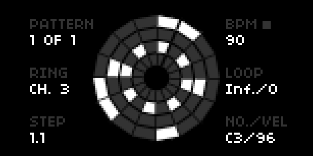

Kreislauf
---

v0.2.0

Beat sequencing rund um den Kreis inspired very heavily by the work of [Ethan Hein](http://www.ethanhein.com/). 

Patterns can be saved and later recalled (along with accomapanying PSET). A number of demo patterns of some staple beats is installed within `~/dust/data/kreislauf/patterns`. `LOAD` and `SAVE` patterns from the params menu.





## Requirements

[Norns](https://monome.org/norns) or [Fates](https://llllllll.co/t/fates-a-diy-norns-dac-board-for-raspberry-pi/22999).


## Install/Update

Kreislauf can be installed via [Maiden's](https://norns.local/maiden) project manager.


## Params

Params also be controled with Midi CC via `MAP` within params menu.

| Controller                    | Description                               | Values                         |
| ----------------------------- | ----------------------------------------- | ------------------------------ |
| **E1**                        | Cycle through patterns                    | 1 –                            |
| **E1+K1**                     | Set BPM                                   | 20 - 300                       |
| **E1+K2**                     | Loop count for active pattern             | Inf, 1 - 32                    |
|                               |                                           |                                |
| **E2**                        | Cycle through rings                       | 1 – 4                          |
| **E2+K1**                     | Set channel for active ring               | 0 - 16                         |
|                               |                                           |                                |
| **E3**                        | Rotate through steps                      | 1 – 16                         |
| **E3+K1**                     | Set note value for active step            | 0 - 127                        |
| **E3+K2**                     | Set velocity value for active step        | 0 - 127                        |
|                               |                                           |                                |
| **K1**                        | Add blank pattern                         |                                |
| **K2**                        | Play/stop                                 |                                |
| **K3**                        | Add beat/note to active step              |                                |
|                               |                                           |                                |
| Fates only                    |                                           |                                |
| **E4**                        | BPM                                       | 20 - 300                       |
| **E4+K1**                     | Step divider                              | 1 - 16                         |


## Development

[SSH](https://monome.org/docs/norns/maiden/#ssh) into your Norns/Fates, then enter the following commands in terminal.

```bash
$ cd dust/code
$ git clone https://github.com/frederickk/kreislauf.git
```


## Changelog
- v0.2.x
    - Added sequencing of multiple patterns
- v0.1.x Initial release